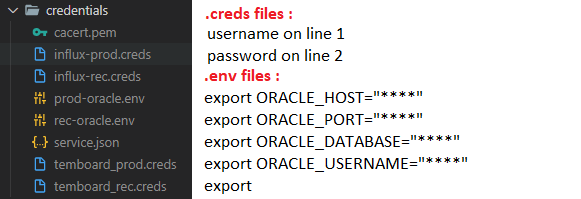

# InfluxDBDataToGoogleSheets
:key: This project goal is to automate enterprise reporting, by formatting InfluxDB data into google spreadsheet, to be used with datastudio. </br></br>
The script : </br>
  &nbsp;&nbsp;&nbsp;&nbsp;0 - Show the progression of execution; </br>
  &nbsp;&nbsp;&nbsp;&nbsp;1 - Get hostnames from temboard PostgreSQL database; </br>
  &nbsp;&nbsp;&nbsp;&nbsp;2 - Format received data to only get hostnames; </br>
  &nbsp;&nbsp;&nbsp;&nbsp;3 - Call InfluxDB with hostnames (rec, prod and dev); </br>
  &nbsp;&nbsp;&nbsp;&nbsp;4 - Format InfluxDB CSV result to only get "mean last month CPU usage" and "mean last month RAM usage"; </br>
  &nbsp;&nbsp;&nbsp;&nbsp;5 - Call InfluxDB to get availability data; </br>
  &nbsp;&nbsp;&nbsp;&nbsp;6 - Call Oracle database to get Ram, CPU and Disk usage (rec, prod and dev); </br>
  &nbsp;&nbsp;&nbsp;&nbsp;7 - Format result returned by oracle; </br>
  &nbsp;&nbsp;&nbsp;&nbsp;8 - Send formatted CSVs to googlesheet; </br>
  &nbsp;&nbsp;&nbsp;&nbsp;8.5 - Create Sheet into Spreadsheet, to write into, if no eponym sheet of formatted file is existing; </br>

## How to Start
```
git clone https://github.com/Kev1venteur/InfluxDBDataToGoogleSheets.git
```

## How to set scripts
:pencil2: Edit your Sheets ID in [this file](send-csv_google-sheets.py#L9). </br></br>
:pencil2: If you have a proxy, refer to [this file](launcher.sh#L7). </br>

## How to set Credentials


## How to set environment
:pushpin: Install the Google Client Library with pip:
``` sh
pip install --trusted-host pypi.python.org --trusted-host files.pythonhosted.org --trusted-host pypi.org --upgrade requests-toolbelt google-api-python-client google-auth-httplib2 google-auth-oauthlib gspread certifi urllib3
```
:pushpin: Create a project and turn on the Google Sheets API from this [page](https://developers.google.com/sheets/api/quickstart/python). (only use the button of the step 1) </br></br>
    &nbsp;&nbsp;&nbsp;&nbsp;&nbsp;&nbsp;&nbsp;&nbsp; :point_right: In resulting dialog you DO NOT NEED to download client configuration.json</br></br>
    &nbsp;&nbsp;&nbsp;&nbsp;&nbsp;&nbsp;&nbsp;&nbsp; :point_right: Now that you have created the project and activated the SPREADSHEET API, you need to enable the DRIVE one. (to work with gspread)</br></br>
:pushpin: Turn on the Google Drive API from this [page](https://console.developers.google.com/apis/library/drive.googleapis.com?q=drive). </br></br>
:pushpin: Create a service account from [here](https://console.developers.google.com/iam-admin/serviceaccounts). (to work on headless servers)</br></br>
    &nbsp;&nbsp;&nbsp;&nbsp;&nbsp;&nbsp;&nbsp;&nbsp; :point_right: Step 1 : Give the name you want to the account.</br></br>
    &nbsp;&nbsp;&nbsp;&nbsp;&nbsp;&nbsp;&nbsp;&nbsp; :point_right: Step 2 : Set the role as "Basic - Editor".</br></br>
    &nbsp;&nbsp;&nbsp;&nbsp;&nbsp;&nbsp;&nbsp;&nbsp; :point_right: Step 3 : Skip it.</br></br>
    &nbsp;&nbsp;&nbsp;&nbsp;&nbsp;&nbsp;&nbsp;&nbsp; :point_right: On the service account create a KEY at json format and download it.</br></br>
    &nbsp;&nbsp;&nbsp;&nbsp;&nbsp;&nbsp;&nbsp;&nbsp; :point_right: Rename your key as "service.json" and put it in the "credentials" folder of the project.</br></br>
:pushpin: Share your spreadsheet with the service account email as editor.</br></br>
:pushpin: Install [Python](https://www.python.org/downloads/) (Tested version 3.9.1) and execute [The Launcher bash script](launcher.sh). </br>

## Examples
Environment: Using InfluxDB Docker container as datasource

``` sh
#-------------------Container Managment----------------------#
#Pull the container
docker pull influxdb

#Start the container
docker run --name=influxdb -d -p 8086:8086 influxdb

#--------------------Database Managment----------------------#
#Create DB via http
curl -i -XPOST http://localhost:8086/query --data-urlencode "q=CREATE DATABASE mydb"

#Write data into DB
curl -i -XPOST 'http://localhost:8086/write?db=mydb' --data-binary 'cpu_load_short,host=server01,region=us-west value=0.64 1434055562000000000'

#Export data from DB to CSV
curl -G 'http://localhost:8086/query?pretty=true' --data-urlencode "db=mydb" --data-urlencode "q=SELECT \"value\" FROM \"cpu_load_short\" WHERE \"region\"='us-west'" -H "Accept: application/csv" > raw-csv-data.csv
```

## How to contribute
Just send a pull-request :trophy:

## Author
:cocktail: <b>Kévin Gillet</b> - <i>Developper | Sysadmin</i> - <a href="https://www.linkedin.com/in/k%C3%A9vin-gillet-50b25b175/">Linkedin</a>.

## Sources
:gem: InfluxDB API : https://docs.influxdata.com/influxdb/v1.8/guides/write_data/ </br>
:gem: Google Sheets API : https://developers.google.com/sheets/api/quickstart/python </br>
